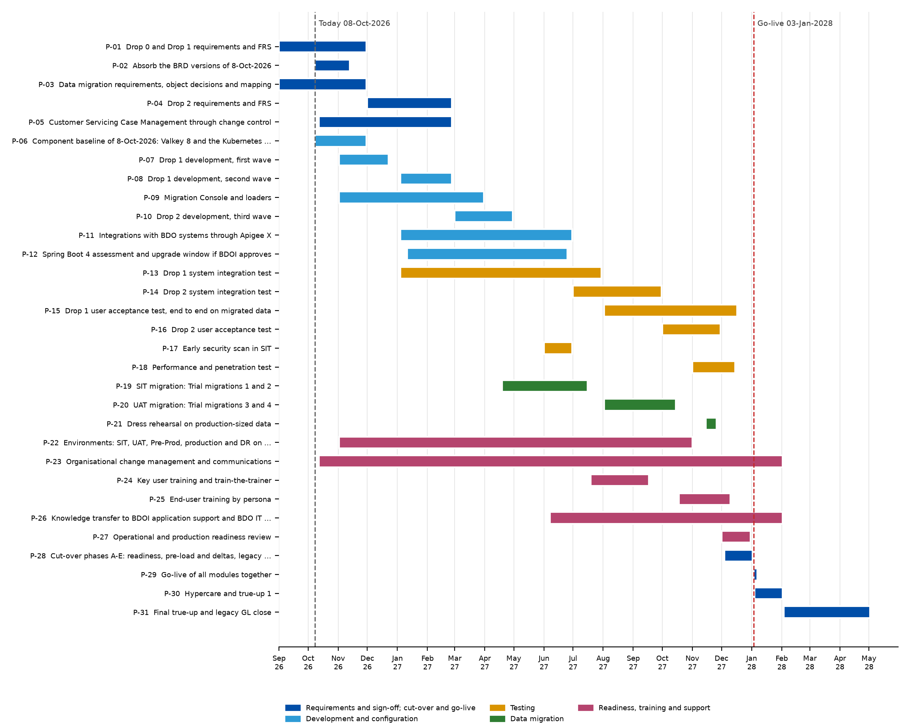

---
# Word summary of the BIBS Project Plan (BRD-00). Built by build_delivery_adoption.py; lines <!-- da:... --> are
# replaced by tables built from plan.yaml and raid.yaml.
title: Project Plan - Summary
subtitle: Phases and drops to the go-live of January 2028, milestones, sign-offs, test windows, trial migrations, cut-over, hypercare and the dependencies on BDOI
doc_type: Project Plan
doc_code: Delivery
brd: BRD-00
name: Project Plan Summary
doc_id: BIBS-PLAN-BRD-00-S
version: "1.0"
date: 08 October 2026
status: Issued for BDOI review
header_title: BIBS Project Plan - Summary
h1_page_break: false
control:
  - version: "1.0"
    date: 08 Oct 2026
    author: iorta TechNXT Project Manager
    reviewer: iorta TechNXT Solution Architect
    approver: Program Manager, Business Project Services (pending)
    change: First issue; plan as of 08-Oct-2026, after the BRD versions and the component baseline decisions of that day
distribution:
  - {name: "Steering committee", role: Approver, organisation: BDOI, purpose: "Approval of the plan and its milestones"}
  - {name: "Program Manager, Business Project Services", role: Approver, organisation: BDO Unibank ESG, purpose: "Plan, drops and dependencies"}
  - {name: "BIBS Product Owner", role: Reviewer, organisation: BDOI, purpose: "Scope and sign-off dates"}
  - {name: "Business owners of BRD-01 to BRD-13", role: Reviewers, organisation: BDOI, purpose: "Sign-off, UAT and training dates of their units"}
  - {name: "Head, BDOI IT; Head, BDOI Information Security", role: Reviewers, organisation: BDOI, purpose: "Environments, integrations and security tests"}
  - {name: Project team, role: Delivery, organisation: iorta TechNXT, purpose: "Execution and weekly status"}
---

# Purpose, audience and scope

## Purpose

This summary presents the plan that takes BIBS (BDOI Broker System on iNXT BrokerVerse) from the requirements of 2026 to the go-live of all modules together in January 2028 and the close of the hypercare and the true-ups. It is the reading guide to the Project Plan workbook **BIBS_Delivery_BRD-00_Project_Plan_v1.0.xlsx**, which holds the timeline by month, the milestones, the sign-offs, the test windows, the cut-over and hypercare phases and the dependencies on BDOI.

## Audience

The steering committee and the Program Manager of Business Project Services (approval), the BIBS Product Owner and the business owners of each BRD (sign-off, UAT and training dates of their units), BDOI IT and Information Security (environments, integrations, security tests) and the iorta TechNXT project team (execution).

## Scope

The plan covers the three BDOI drops and the programme-level activities:

- **Drop 0 - Setup and Data Migration**: BRD-03 Product Maintenance, BRD-11 User Access Maintenance and BRD-13 Data Migration, with the GL accounts and reference tables of BRD-05;
- **Drop 1 - Transactional**: BRD-01 New Business, BRD-02 Operations, BRD-04 Collections, BRD-05 Accounting, Disbursement and ACSL, BRD-06 Renewal, BRD-09 Customer Servicing Facility, BRD-10 Sanction Screening and BRD-12 Submitted Policies;
- **Drop 2 - Independent**: BRD-07 Claims and BRD-08 Employee Benefits, with Production Reconciliation and the Marketing Collection extraction;
- **Programme**: environments, integrations with BDO systems, performance and penetration tests, organisational change management, training, knowledge transfer, operational readiness, cut-over, hypercare and the true-ups after go-live.

Reinsurance is phase 2 and outside this plan; Remittance handles the reinsurance transactions in Drop 1. BIBS is a broker system: the insurer-company functions of the platform (insurer underwriting, insurer claims, treaty and cession accounting, actuarial reserves, group consolidation, insurer taxes) are not part of the BIBS release.

# Planning basis

<!-- table: widths=4.2,12.4 caption="What the plan rests on" size=8.5 -->
| Basis | Content |
|---|---|
| BDOI drop plan and programme timeline (26-Sep-2026) | Requirements Drop 1 and migration Sep - Nov 2026, Drop 2 Dec 2026 - Feb 2027; development Drop 1 Nov 2026 - Feb 2027, migration Nov 2026 - Mar 2027, Drop 2 Mar - Apr 2027; SIT Drop 1 Jan - Jul 2027, migration Apr - Jul 2027, Drop 2 Jul - Sep 2027; UAT Drop 1 Aug - Dec 2027, migration Aug - Oct 2027, Drop 2 Oct - Nov 2027; performance and penetration test Nov - Dec 2027; ORR / PRR Dec 2027 - Jan 2028; full migration and cut-over Nov 2027 - Jan 2028; go-live January 2028 |
| BDOI answers of 26-Sep-2026 | All modules go live together; no early go-live; drops split the workload, the platform goes to UAT complete; documents in S3 only; reinsurance phase 2 |
| Drop 0 closure summary v2.0 (5-Oct-2026) | Sign-off dates of the Drop 0 sets; configuration due milestones D1 to D7; decisions DEC-01 to DEC-15; risks RSK-01 to RSK-07; dependencies DEP-01 to DEP-07 |
| Data Migration Handbook (BRD-13) | Milestones M0 to M6; four trial migrations and a dress rehearsal; cut-over phases A to H for T = Monday 3-Jan-2028; hypercare to T+30 and true-ups to T+120 |
| Programme alignment pack | Deliverable dates per stream, integration inventory, IER review, open questions IQ01 to IQ35 |
| Versions of 8-Oct-2026 | New versions of ten BDOI source documents; component baseline: PostgreSQL 16, Valkey 8, Apache Kafka 3.9, OpenJDK 21 LTS, Spring Boot 3.5, React, Node 22 LTS (packaging only), nginx, managed Kubernetes, Kubernetes Gateway API |

# Timeline

The figure shows the activities of the plan by month; the workbook sheet Timeline has the same rows with their owners and outputs. Today (8-Oct-2026) the programme is in the requirements phase of Drop 0 and Drop 1 and absorbs the BRD versions received the same day.

{width=17}

<!-- da:timeline -->

## Phases

<!-- table: widths=3,3.2,10.4 caption="Phases of the programme" size=8.5 -->
| Phase | Window | What is done and what closes it |
|---|---|---|
| Requirements and sign-off | Sep 2026 - Feb 2027 | FRS, test plans and sign-off sets per BRD; clarifications decided; Drop 0 closed by the steering committee (proposed 9-Dec-2026); Drop 1 FRS signed by 30-Nov-2026, Drop 2 by 26-Feb-2027 |
| Development and configuration | Nov 2026 - Jun 2027 | Three development waves (setup and upstream; downstream; independent modules), each about two months; Migration Console; integrations through Apigee X; configuration inputs D1 to D5 |
| System integration test | Jan - Sep 2027 | Drop 1 SIT Jan - Jul 2027 on the SIT environment from 4-Jan-2027; Drop 2 SIT Jul - Sep 2027; Trial migrations 1 and 2 |
| User acceptance test | Aug - Dec 2027 | Drop 1 end to end on migrated data (Trial migration 3); Drop 2 Oct - Nov 2027; Trial migration 4 |
| Readiness | Jun 2027 - Jan 2028 | Knowledge transfer from 7-Jun-2027; key user training Jul 2027; train-the-trainer Sep 2027; end-user training 18-Oct to 10-Dec-2027; performance and penetration test; dress rehearsal 15-26 Nov 2027; ORR / PRR |
| Cut-over and go-live | 4-Dec-2027 - 3-Jan-2028 | Phases A to F; go / no-go on Sunday 2-Jan-2028; go-live Monday 3-Jan-2028 |
| Hypercare and true-ups | 4-Jan - 2-May-2028 | Hypercare to 2-Feb-2028 with the first month-end close; hand-over to production support; true-ups closed 2-May-2028 |

# Milestones

<!-- da:milestones -->

# Sign-offs

Each document set is signed as one unit by the roles of its BRD approval sheet ("Who signs what" in the 00 Start Here of the set). After signature, nothing changes without a change request (see the Delivery Methodology). The BRD versions of 8-Oct-2026 are absorbed in version 2.1 of the issued sets (or the next minor version of an FRS issued alone) before signature, so that each set is signed once against the current BRD.

<!-- da:signoffs -->

# SIT and UAT windows, trial migrations and performance test

<!-- da:test_windows -->

The UAT of Drop 1 runs end to end on migrated data: Trial migration 3 loads the UAT environment in August 2027, and Trial migration 4 in October 2027 is timed as a cut-over. Business users therefore test their processes on their own clients, policies and open items.

# Cut-over, go-live and hypercare

Go-live T is proposed for Monday 3-Jan-2028, at the year-end boundary (year-end option A, awaiting the confirmation of Comptrollership, DEC-01). Days are calendar days; tasks that would fall on the year-end holidays are placed on the nearest working day. The detailed cut-over runbook (tasks CT-001 onwards) is in the Data Migration Handbook.

<!-- da:cutover -->

Hypercare exit on 2-Feb-2028 requires: the first month-end close completed with the ACSL reconciliation without difference, true-up 1 signed, no open Severity 1 incident and no Severity 2 older than five working days, the adoption KPIs of the first month met (see the Change Management and Training Framework) and the knowledge transfer readiness assessment passed.

# Dependencies on BDOI

The plan depends on decisions, data, environments, integrations and people that BDOI provides. Each dependency has an owner and a date; a late dependency is raised in the weekly programme meeting and, when it moves a milestone, at the steering committee.

<!-- da:dependencies -->

# Critical path

The critical path to the go-live runs through: the sign-off of the Drop 0 and Drop 1 sets (30-Nov-2026 and 1-Dec-2026) - the SIT environment and the D2 set-up (4-Jan-2027) - the first full extracts (29-Jan-2027) - Trial migration 1 (19-Apr-2027) - code maps approved (18-Jun-2027) - Trial migration 2 and the Drop 1 SIT exit (30-Jul-2027) - Drop 1 UAT on Trial migration 3 (2-Aug-2027) - Pre-Prod (1-Oct-2027) - production values D6 and production environments (1-Nov-2027) - dress rehearsal (26-Nov-2027) - UAT sign-off (17-Dec-2027) - map freeze (27-Dec-2027) - go / no-go (2-Jan-2028). Each step has between zero and two weeks of float; a slip of a dependency on this path moves the go-live unless the next step is compressed.

{width=17}

# Governance of the plan

- The iorta TechNXT Project Manager keeps the plan and the RAID log and reports weekly to the programme meeting (progress against milestones, dependencies due in the next four weeks, High risks and issues).
- The steering committee meets monthly and at each drop closure, approves milestone changes and decides escalations.
- A change to a milestone date in the workbook is made only after the steering committee decision; the version of the workbook increases and the change is recorded on its cover.

# Top risks to the plan

<!-- da:risks high -->

The full risk register is the workbook **BIBS_Delivery_BRD-00_Risk_Register_RAID_Log_v1.0.xlsx**.

# References

- BDOI drop plan and programme timeline (received 26-Sep-2026) and the BDOI answers of 26-Sep-2026.
- Drop 0 closure summary and configuration inputs workbook, version 2.0 (5-Oct-2026).
- BRD-13 Data Migration Handbook, sign-off set v2.0, and the Data Migration BRD V0.03.
- BIBS programme alignment pack: drops, integrations and infrastructure, version 1.0.
- Change Management Register and summary, version 1.0.
- BDOI source documents received on 8-Oct-2026 and the client decisions on the component baseline of the same day.
- IER Workbook v20 (infrastructure estimate).

# Decisions and open points for BDOI

<!-- table: widths=1.2,7.6,3.6,2.2,2 caption="Decisions and open points" size=8.5 -->
| No. | Decision or open point (our proposal) | Owner | Needed by | Ref. |
|---|---|---|---|---|
| PP-01 | Confirm go-live T = Monday 3-Jan-2028 with the year-end option A | Steering committee; Head, Comptrollership | 1-Oct-2027 (we ask with the Drop 0 closure) | IQ01, DEC-01 |
| PP-02 | Confirm the Drop 0 closure on 9-Dec-2026 at the steering committee | Program Manager | 30-Nov-2026 | Drop 0 closure |
| PP-03 | Decide the scope and drop of Customer Servicing Case Management; we propose Drop 2 (development Mar - Apr 2027) through a change request | Product Owner, CSF; CCB | 30-Oct-2026 | R-02 |
| PP-04 | Decide the Data Migration V0.03 conflicts (renewals in progress, claims, submitted policies, payees, e-policy linking) | Program Manager; Head of the Renewal processing team | 30-Oct-2026 (M2) | R-03 |
| PP-05 | Confirm the environment dates: SIT 4-Jan-2027, UAT and training 19-Jul-2027, Pre-Prod 1-Oct-2027, production and DR 1-Nov-2027 | BDOI IT | 30-Nov-2026 | R-08 |
| PP-06 | Approve the early security scan in SIT in June 2027 and name the penetration test provider | BDOI Information Security | 31-May-2027 | IQ35 |
| PP-07 | Decide the Spring Boot 4 upgrade window: May - Jun 2027 (our proposal) or after hypercare | BDOI IT; CCB | 31-Mar-2027 | R-06 |
| PP-08 | Confirm the UAT sign-off date of Drop 1 (17-Dec-2027) and the hypercare exit criteria | BIBS Product Owner | 16-Jul-2027 | - |
| PP-09 | Name the UAT testers, trainers and the application support team on the dates of the dependencies DEP-18, DEP-20 and DEP-22 | Business owners; BDOI IT | As listed | - |
